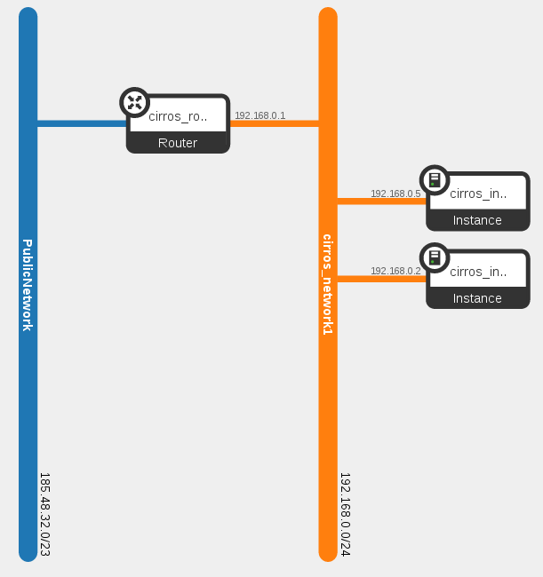

**NOTE: work in process / proof of concept**

Phoobe
======

Phoobe is a tiny and lightweight wrapper for the
`OpenStack orchestration service <https://github.com/openstack/heat>`_. Phoobe
is inspired by `Vagrant <https://github.com/mitchellh/vagrant>`_. Use
`vagrant-openstack-provider <https://github.com/ggiamarchi/vagrant-openstack-provider>`_
if you want to use Vagrant with `OpenStack <http://www.openstack.org/>`_.

Installation
------------

.. code::

 $ virtualenv .venv
 $ source .venv/bin/activate
 $ pip install -r requirements.txt
 $ python setup.py install

Usage of Phoobe is now possible with the command ``phoobe``.

Cloud credentials
-----------------

Phoobe uses the `os-client-config <https://github.com/openstack/os-client-config/>`_
library to get credentials. The following ``clouds.yaml`` file defines the
credentials for ``yourcloud``. Use the credentials with ``--os-cloud yourcloud``.
The default value of ``--os-cloud`` is ``phoobe``. Place this file in the current
directory, ``~/.config/openstack``, or ``/etc/openstack``.

.. code::

  clouds:
    yourcloud: 
      auth:
        auth_url: https://identity.yourcloud.site/v2.0
        username: username
        password: secretsecret
        project_name: projectname
      region_name: RegionOne

Environment definition
----------------------

.. code::

 ---
 defaults:
   instance:
     image: Cirros 0.3.3
     flavor: e1standard.x1
     network: network1
     username: cirros
 networks:
   network1:
     cidr: 192.168.0.0/24
     external: PublicNetwork
 instances:
   instance1:
     name: instance1
   instance2:
     name: instance2

This example environment will result in the following topology.

Commands
--------

list commands
~~~~~~~~~~~~~

Use the following ``list`` commands to list existing resources.

* ``list flavors``
* ``list images``
* ``list networks floating``
* ``list networks internal``

up command
~~~~~~~~~~

.. code::

 $ phoobe --environment-file samples/cirros.yaml --environment-name cirros up

status command
~~~~~~~~~~~~~~

.. code::

 $ phoobe --environment-file samples/cirros.yaml --environment-name cirros status
 +-----------+-----------------+----------------+
 | instance  | status          | public_address |
 +-----------+-----------------+----------------+
 | instance2 | CREATE_COMPLETE | a.b.c.d        |
 | instance1 | CREATE_COMPLETE | a.b.c.d        |
 +-----------+-----------------+----------------+

resources command
~~~~~~~~~~~~~~~~~

.. code::

 $ phoobe --environment-file samples/cirros.yaml --environment-name cirros resources
 +------------------------------+----------------------------------+-----------------+
 | resource_type                | resource                         | status          |
 +------------------------------+----------------------------------+-----------------+
 | OS::Neutron::Port            | port_instance2_network1          | CREATE_COMPLETE |
 | OS::Neutron::Subnet          | subnet_network1                  | CREATE_COMPLETE |
 | OS::Neutron::FloatingIP      | floatingip_instance2             | CREATE_COMPLETE |
 | OS::Neutron::FloatingIP      | floatingip_instance1             | CREATE_COMPLETE |
 | OS::Neutron::Port            | port_instance1_network1          | CREATE_COMPLETE |
 | OS::Neutron::Net             | net_network1                     | CREATE_COMPLETE |
 | OS::Nova::Server             | instance2                        | CREATE_COMPLETE |
 | OS::Nova::KeyPair            | keypair                          | CREATE_COMPLETE |
 | OS::Nova::Server             | instance1                        | CREATE_COMPLETE |
 | OS::Neutron::RouterInterface | router_interface_subnet_network1 | CREATE_COMPLETE |
 | OS::Neutron::SecurityGroup   | security_group                   | CREATE_COMPLETE |
 | OS::Neutron::Router          | router                           | CREATE_COMPLETE |
 +------------------------------+----------------------------------+-----------------+

ssh command
~~~~~~~~~~~

.. code::

 $ phoobe --environment-file samples/cirros.yaml --environment-name cirros ssh instance1
 Warning: Permanently added 'a.b.c.d' (RSA) to the list of known hosts.
 $ uptime
  11:54:13 up 1 min,  1 users,  load average: 0.00, 0.00, 0.00

provision command
~~~~~~~~~~~~~~~~~

sync command
~~~~~~~~~~~~

destroy command
~~~~~~~~~~~~~~~

.. code::

 $ phoobe --environment-file samples/cirros.yaml --environment-name cirros destroy

suspend command
~~~~~~~~~~~~~~~

resume command
~~~~~~~~~~~~~~
